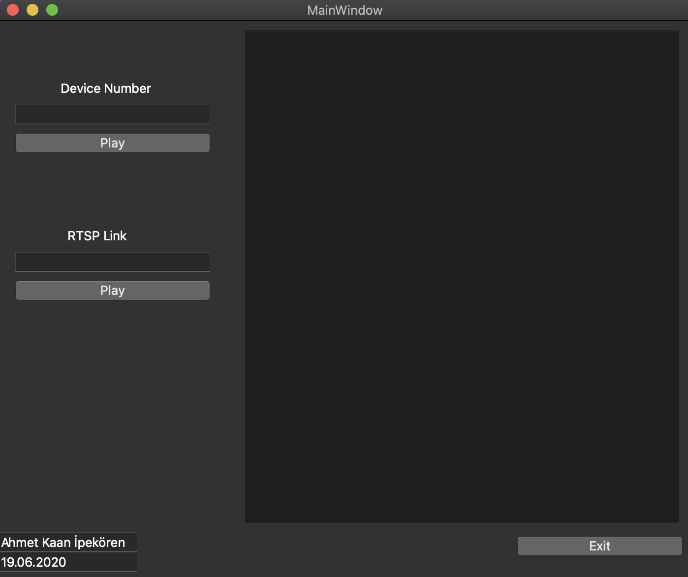

# User-Interface-for-WebCam-with-OpenCv

This project can manage the different webcams connected to your computer. User interface let you to choose which webcam to open by giving the webcam ID.

Secondly the program lets you to use RTSP by giving your IP Webcam (example : rtp://127.0.0.1:1234).

Finally you can give a video path to input file to open video in your computer.

This is the User Interface of the Project

For example when we write 0, the main computer webcam starts....

